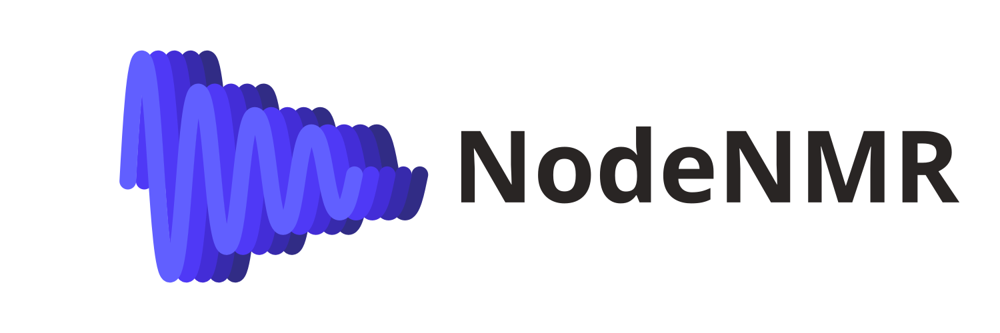

<picture>
  <source media="(prefers-color-scheme: dark)" srcset="assets/banner-dark.svg"></source>
  <source media="(prefers-color-scheme: light)" srcset="assets/banner-light.svg"></source>
  </img>
</picture>

NodeNMR is an open source tool for denoising NMR signals. It provides a simple node graph interface for building denoising pipelines without any code. It includes several denoising methods optimized to run on consumer hardware.
Currently, it supports only 1D datasets.